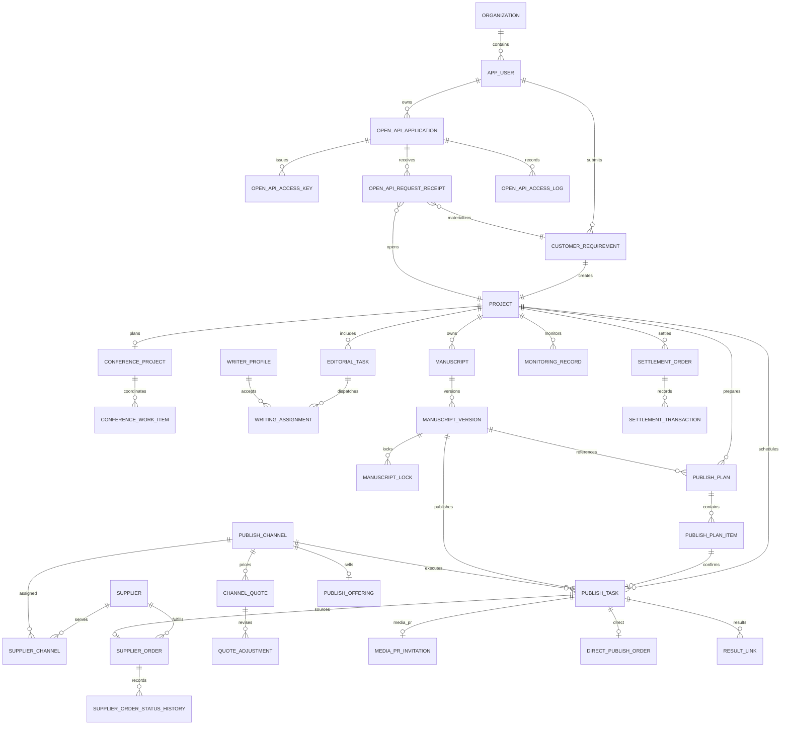

# PostgreSQL 数据库说明

数据库版本：PostgreSQL 17。结构脚本为 `database/schema.sql`；`database/seed.sql`、四个品牌案例、两个媒体 CSV 与 `database/03-media-import.sql` 只用于隔离的本机演示与回归。生产首建不自动导入这些演示或未验收的外部媒体输入。

> 本文说明当前结构和受控本机演示数据边界，不是外部媒体目录、报价、供应商关系或生产数据的授权清单。当前产品验收以 [`PRODUCT-PRD-V4.2.md`](PRODUCT-PRD-V4.2.md)、[`WINPRESS-GLOBAL-PRODUCT-CODE-AUDIT-20260728.md`](WINPRESS-GLOBAL-PRODUCT-CODE-AUDIT-20260728.md) 与 [`P0-P1-EXECUTION-QA-20260728.md`](P0-P1-EXECUTION-QA-20260728.md) 为准。

## 业务表

| 表 | 用途 | 关键关联 |
|---|---|---|
| `organization` | 客户单位与平台组织 | `app_user.organization_id` |
| `app_user` | 用户账号 | 组织、项目、任务、日志 |
| `sys_role` | 客户、发布运营、平台运营 | `user_role` |
| `sys_permission` | 操作权限 | `role_permission` |
| `user_role` | 用户角色关系 | 用户、角色 |
| `role_permission` | 角色权限关系 | 角色、权限 |
| `customer_requirement` | 客户服务订单；保存服务类型、采写人数、天数、单价、基础金额与现场联系人 | 客户、组织 |
| `project` | 项目主记录 | 需求、客户、负责人 |
| `conference_project` | 新闻发布会信息与项目状态 | 项目、会务联系人、媒体与传播目标 |
| `conference_work_item` | 发布会统筹清单 | 发布会项目、服务运营 |
| `conference_media_candidate` | 发布会拟邀媒体候选与执行状态 | 发布会项目、候选媒体、项目负责人 |
| `business_inquiry` | 服务咨询、API 接入和商务合作线索 | 咨询类型、联系人、处理人 |
| `editorial_task` | 资料撰稿或现场采写任务 | 项目、需求、平台写手 |
| `service_price_book` | 服务目录与生效价格；云采写当前为 980 元/人/天 | 服务编码、生效区间 |
| `writer_profile` | 平台写手服务城市、可用状态和内部调度资料 | 用户账号 |
| `writing_assignment` | 云采写匹配、派单、接单与金额快照 | 采写任务、写手 |
| `writing_assignment_member` | 云采写的逐写手名额、响应和服务时段；已确认档期在数据库层互斥 | 派单、写手档案 |
| `manuscript` | 稿件资产 | 项目、撰稿任务、确认版本 |
| `manuscript_version` | 稿件版本与审核记录 | 稿件、提交人、审核人 |
| `publish_channel` | 记者邀约和直编媒体 | 渠道报价 |
| `channel_quote` | 内部成本、客户服务价和有效期 | 发布渠道 |
| `quote_adjustment` | 成本价与客户服务价的调整版本、原因与操作人 | 渠道报价 |
| `supplier` | 上游执行服务商，仅平台运营可见 | 渠道关系、供应商订单 |
| `supplier_api_connection` | 供应商接口参数、凭据环境变量名称与三阶段验收状态，仅平台管理员可见 | 供应商、创建人、更新人 |
| `platform_acceptance_gate` | 外部数据、真实履约、法律、生产运维与历史记录的上线关卡 | 复核人、验收证据 |
| `platform_acceptance_evidence_item` | 五项上线关卡下的 28 项必备证据与复核状态 | 上线关卡、复核人 |
| `legacy_service_review` | 历史组合服务逐条业务审核；不执行自动迁移 | 历史需求、复核人 |
| `schema_migration_ledger` | 已核验结构的追加式迁移台账；不回填历史执行记录 | 迁移版本、脚本、合同版本、核验引用 |
| `supplier_channel` | 供应商与渠道的可执行关系 | 供应商、发布渠道 |
| `supplier_order` | 受控后台的内部执行与待提交记录；不表示已向外部供应商提交 | 供应商、发布任务、价格快照 |
| `supplier_order_status_history` | 供应商订单状态变更记录 | 供应商订单、操作人 |
| `media_outlet` | 规范化媒体主体 | 媒体联系人、渠道商品 |
| `media_contact` | 媒体公开联系人及所属线口；不等同于平台写手 | 媒体主体 |
| `publish_offering` | 面向客户的可售渠道商品与当前报价 | 媒体主体、发布渠道、报价 |
| `publish_plan` | 客户保存并待确认的发布计划；普通媒体邀请可不绑定稿件 | 项目、可选确认稿件版本 |
| `publish_plan_item` | 发布计划中的渠道、价格与说明快照 | 发布计划、渠道商品 |
| `manuscript_lock` | 既有稿件安排的存量兼容记录；不开放新建 | 稿件版本、锁定人 |
| `publish_task` | 确认计划后生成的统一发布任务；普通媒体邀请可不绑定稿件 | 计划项、项目、可选稿件版本、渠道、执行人 |
| `media_pr_invitation` | 媒体邀请与反馈；可保存候选媒体公开属性 | 发布任务 |
| `direct_publish_order` | 直编发稿订单 | 发布任务、报价 |
| `direct_publish_order_item` | 直编发稿媒体项 | 订单、渠道、报价 |
| `monitoring_record` | 链接与传播监测 | 项目、发布任务 |
| `result_link` | 成果链接与核验 | 项目、发布任务 |
| `settlement_order` | 项目结算和开票 | 项目、组织 |
| `settlement_transaction` | 有凭据的收款、退款、贷项、借项与核销台账 | 结算单、登记人、作废人 |
| `file_asset` | 项目材料元数据 | 项目、上传人 |
| `operation_log` | 关键业务操作日志 | 操作人、目标对象 |

当前结构以 `schema.sql` 与迁移 `13` 至 `41` 为权威来源。干净本机回归会在临时数据库中依次执行本机演示初始化文件并核验四服务、活动关联、稿件来源、人工媒体名单待核验、服务受理标题完整性、交易凭据约束、客户下单与发布计划幂等结构、任务验收、渠道报价、媒体邀约进度、任务终态、结算交易防重、批量调价幂等批次、发布计划服务边界、接口启用验收、开放 API 密钥／回执、逐项上线证据约束、追加式迁移台账、媒体成果事实链、云采写写手名额／档期互斥及服务半径约束，以及发布会统筹事项与候选名单的状态／时间线保护；生产环境则按下文“生产首建”列表执行，不以演示表数量或样本数据作为上线证据。所有核心表均含主键、状态、创建时间和更新时间；业务主表另有不可变业务编号。供应商订单只在受控后台中作为内部协同对象存在；在获得实际供应商关系、授权和执行回执前，不能把记录创建或状态变化表述为对外已提交、已接受或已履约。

`publish_plan.manuscript_id/version_id` 与 `publish_task.manuscript_id/version_id` 允许为空，仅用于支持从活动简报直接发起媒体邀请。直编发稿仍由服务层强制绑定已确认稿件版本；数据库可空不等于直编发稿可绕过审核。`manuscript_lock` 仅为既有记录保留兼容约束，当前客户入口不会创建新的锁定安排。

迁移 `21-manual-media-invitation-pending-verification.sql` 仅将 `publish_plan_item.channel_id` 与 `publish_task.channel_id` 调整为可空，以承载客户人工补充、尚待项目核验的 `MEDIA_PR` 名单。空值不表示渠道已建立、供应商已确定、价格已确认或邀请已发出；直编发稿仍必须绑定有效渠道与客户服务价，供应商订单也仍要求实际渠道。

迁移 `22-service-intake-title-integrity.sql` 只恢复历史数据中已经被问号替换的服务受理标题，并为 `service_intake_task.title` 增加非空、非纯问号约束。修复根据既有服务类型还原为“确认媒体邀请范围”或“确认稿件与发稿范围”，不推测原始媒体、渠道、供应商、成本或报价。

迁移 `23-settlement-transaction-ledger.sql` 建立 `settlement_transaction`。交易必须具有正金额，并至少填写凭据编号或客户可见说明；作废只改变记录状态，不删除原记录。`settlement_order.paid_amount` 只由有效收款减有效退款汇总，结算状态本身不能制造付款。贷项、借项和核销只调整应结余额，不伪装成资金到账。

迁移 `24-requirement-idempotency.sql` 为 `customer_requirement` 增加 `submission_key` 与 `submission_hash`。两列必须同时为空或同时有值；同一客户、同一组织的非空请求标识唯一。历史记录不伪造请求标识，新客户下单由后端绑定请求标识与内容摘要，网络重试只读取原项目，不重复创建项目、任务和订单。

迁移 `25-task-acceptance-integrity.sql` 固化 `publish_task`、`media_pr_invitation` 与 `result_link` 的状态约束，并禁止同一任务重复登记同一成果链接。服务端在客户验收和运营回填成果时锁定任务并执行条件更新：只有存在已核验成果的 `COMPLETED` 任务可验收；`CLIENT_ACCEPTED` 为终态，不能被运营回退或再次提交成果。重复验收返回同一终态，不生成新的验收事实。

迁移 `26-channel-quote-integrity.sql` 固化直编渠道报价边界：客户价必须大于零，成本价不得为负或高于客户价，结束时间必须晚于生效时间，状态只能使用受控枚举。同一渠道最多保留一条 `ACTIVE` 报价；调价事务先锁定渠道行，重叠批量调价按渠道编号稳定加锁。迁移只验证并约束既有报价，不改写价格、成本、供应商或有效期。

迁移 `27-media-invitation-progress-integrity.sql` 为媒体邀约增加 `NOT_PROCEEDING` 通用任务终态，并限制该终态只能用于 `MEDIA_PR`。已邀请、已回复、确认出席、拒绝或不再推进等已有邀约事实会与通用任务、发布计划和项目状态对齐；已确认计划对应的服务受理任务完成。拒绝不等于报道完成，不能补录成果；迁移不生成或推测任何媒体联系、回复、到场、报道、价格、供应商或上游数据。

迁移 `28-publish-task-terminal-integrity.sql` 为发布任务建立数据库终态保护。`COMPLETED` 只能继续保持完成或进入客户验收，`CLIENT_ACCEPTED` 与 `NOT_PROCEEDING` 不得被后台、供应商订单或其他写入旁路重新打开；进入客户验收前必须已有已核验成果。迁移安装前只检查存量一致性，不补写成果、验收、供应商状态或履约记录。

迁移 `29-publish-plan-idempotency.sql` 为 `publish_plan` 增加 `submission_key` 与 `submission_hash`。两列必须同时为空或同时有值；同一项目、同一创建人使用的非空请求标识唯一。相同标识与相同内容的网络重试返回原计划；相同标识携带不同内容会被拒绝。历史计划保持空值，迁移不会生成媒体选择、任务、订单、价格、供应商或履约事实。

迁移 `30-settlement-transaction-idempotency.sql` 为 `settlement_transaction` 增加 `submission_key` 与 `submission_hash`。两列必须同时为空或同时有值；同一结算单的非空请求标识唯一。相同标识与相同交易内容的重试返回原交易，不重复改变实收、退款或调整金额；相同标识改传另一笔交易会被拒绝。历史交易保持空值，迁移不制造收款、退款、调整、核销、发票或供应商事实。

迁移 `31-batch-quote-adjustment-idempotency.sql` 新增 `quote_adjustment_batch`，并以 `quote_adjustment.batch_id` 将批次与每条调价明细关联。同一管理员的请求标识唯一，内容摘要绑定渠道集合、调价比例、报价截止时间、对客条款和原因；相同请求重试返回原批次明细，不再次改价。渠道按稳定顺序加锁，批次只有全部明细写入后才能标记完成。迁移可重复执行，不生成报价、不改写历史价格，也不补充供应商、成本或外部渠道事实。

迁移 `32-publish-plan-service-integrity.sql` 在发布计划明细、计划所属项目、项目所属需求及需求服务类型四个变更入口建立服务边界。只有媒体邀请项目可以承载 `MEDIA_PR` 计划，只有直编发稿项目可以承载 `DIRECT_PUBLISHING` 计划；云采写和新闻发布会不承载发布计划。迁移不改写已有错配记录，客户查询会隔离这些历史记录，确认操作会拒绝继续生成任务或订单。

迁移 `33-supplier-api-connections.sql` 新增管理员专属的接口配置、平台上线验收和历史组合服务审核台账。凭据只保存环境变量名称；正式授权、沙箱联调与生产批准均有证据约束，三项未齐备时接口不能启用。迁移把存量 `WRITING_AND_PUBLISHING` 需求登记为待审核记录，不拆分、不改价、不归档、不删除，也不改变项目、任务、订单或结算事实。

迁移 `34-open-api-management.sql` 将独立 API 工具的客户系统接入能力纳入当前平台。它新增接入应用、仅保存哈希的访问密钥、请求受理回执和访问摘要四类对象：应用必须绑定一个有效客户账号，接口创建的需求继续进入既有项目、任务与订单链路；密钥明文和请求正文不入库、不回显。应用启用前必须留存授权与沙箱证据，生产环境还须留存生产验收证据。迁移不导入旧工具的数据库、密钥、外部媒体数据、供应商或演示订单。

迁移 `35-release-governance-and-evidence.sql` 新增 28 项逐项验收材料，并把总关卡、接口连接和业务事实联动起来。外部媒体关卡只有在授权、范围、生产凭据、限流和沙箱联调全部核验，且存在已批准的生产媒体检索连接时才能通过；供应商真实履约关卡还要求订单、状态、回调、对账和服务等级配置齐全。供应商订单只有明确标记为人工提交或 API 提交并附提交证据，才能进入“已提交”及之后状态。新建组合服务在数据库层直接拒绝；存量组合记录只有匹配到已批准的人工审核决定后才允许转换，迁移本身不拆单、不改价、不归档、不删除。

迁移 `36-schema-migration-ledger.sql` 为已核验的 schema 35 建立一条 `BASELINE` 记录，健康检查同时核对表、记录和追加式保护触发器。它不把旧脚本倒灌为已执行，不保存凭据、业务正文或外部履约信息；后续结构变更必须追加新的 `FORWARD` 记录并通过同等备份、迁移和回归验证。

迁移 `37-media-pr-result-integrity.sql` 追加媒体成果事实链门禁。发布任务进入 `COMPLETED` 前必须已有 `VERIFIED` 成果；若任务为 `MEDIA_PR`，还必须已有带邀请时间的 `REPORTED` 媒体邀请记录。安装前会先检查存量矛盾；发现缺少成果、已邀事实或报道结果即停止并等待业务核验，不会补写任何业务事实。

迁移 `38-writing-assignment-slot-schedule-integrity.sql` 增加 `writing_assignment_member`。每位写手在同一云采写订单中有独立名额、响应状态和服务时段；同一写手的两个 `ACCEPTED` 时段重叠会被 PostgreSQL 排他约束拒绝。父派单只有全部名额确认后才进入 `ACCEPTED`，未满额时显示为 `PARTIALLY_ACCEPTED`。安装前会核验存量活跃派单是否具有真实写手和服务时间；存量已确认多人派单或重叠档期无法无损还原时，迁移会停止，等待业务形成映射清单，绝不自动拆单或补造名额。

迁移 `39-writing-assignment-radius-integrity.sql` 使 `writer_profile.service_radius_km` 成为活跃写手名额的实际约束。写手已配置半径时，`OFFERED`、`ACCEPTED` 名额必须具有人工核验的非负 `distance_km`，且不得超过半径；下调半径若会导致任何活跃名额越界，数据库会拒绝。该机制不接入定位、地图或自动距离推算，不会替历史记录补写距离；发现存量活跃名额缺距离或超出已配置半径时，迁移会停止等待业务确认。

迁移 `40-conference-work-item-state-integrity.sql` 为 `conference_work_item` 增加完成时间一致性约束，并以触发器保护合法状态迁移与终态：`COMPLETED` 事项不能回退，完成态项目必须由全部已完成事项组成。它不推断历史完成时间，也不更改已有项目或事项；若存量数据出现“完成但无完成时间”“未完成却有完成时间”或“项目完成而事项未完成”，迁移会中止，须凭业务记录人工核验后再继续。

迁移 `41-conference-media-candidate-state-integrity.sql` 为 `conference_media_candidate` 增加候选状态、邀请／回复时间和结果说明的一致性约束，并以触发器保护推进顺序：`CANDIDATE` 只能进入 `READY_TO_INVITE` 或 `NOT_PROCEEDING`，经 `INVITED` 后才可记录 `RESPONDED`、`ATTENDING`、`DECLINED` 或 `NOT_PROCEEDING`。邀请和回复时间一经记录不得篡改，结果状态必须附跟进说明。它不推断、补写或修改任何历史邀请、回复、到场、联系人或履约事实；存量时间线或说明矛盾时迁移会中止，须凭业务记录人工核验后再继续。

## 本机数据库备份恢复验证

`scripts/verify-local-database-backup-restore.ps1` 只接受当前项目本机演示编排启动的健康 PostgreSQL 容器。脚本使用 PostgreSQL 自定义格式备份，在无宿主机端口和无持久化数据卷的临时容器中恢复，再比对关键业务表汇总、四项独立服务类型、迁移 `22` 的标题完整性约束、迁移 `23` 的交易凭据约束、迁移 `24` 的下单幂等结构、迁移 `25` 的任务验收完整性、迁移 `26` 的报价约束与有效报价唯一性、迁移 `27` 的媒体邀约进度完整性、迁移 `28` 的任务终态保护、迁移 `29` 的发布计划幂等结构、迁移 `30` 的结算交易防重结构、迁移 `32` 的发布计划服务边界、迁移 `33` 的接口启用和历史审核约束、迁移 `34` 的开放 API 密钥与受理回执边界、迁移 `35` 的逐项证据、供应商订单履约凭据和历史组合服务数据库保护、迁移 `36` 的追加式台账基线、迁移 `37` 的媒体成果事实链、迁移 `38` 的写手名额与档期互斥约束、迁移 `39` 的写手服务半径和人工距离约束，以及迁移 `40` 的发布会统筹事项状态与迁移 `41` 的候选名单时间线保护；校验结束后自动删除备份和临时容器。脚本只读取汇总，不输出客户明细、账号凭据、密钥或业务正文。

该验证只覆盖 PostgreSQL 数据及 `file_asset` 元数据。上传文件本体可用 `scripts/verify-local-upload-backup-restore.ps1` 在独立临时 Docker 卷中恢复并比对文件哈希、数字所有者、权限、大小和目录集合；脚本不打印文件名或内容，结束后清理临时归档和卷。Redis 数据及其他外部存储不在两项脚本范围内。生产环境仍须另行验证加密备份、访问权限、上传目录、保留周期、异地副本、恢复时间目标和恢复点目标；本机通过不能替代生产恢复验收。

## 主要关系

## 状态

稿件状态：`DRAFT`、`CLIENT_REVIEW`、`CLIENT_RETURNED`、`CLIENT_APPROVED`、`READY_TO_PUBLISH`、`PUBLISHING`、`PUBLISHED`、`MONITORING`、`ARCHIVED`。

发布任务状态：`PENDING_ASSIGNMENT`、`PENDING_EXECUTION`、`IN_PROGRESS`、`NEEDS_INFO`、`EXCEPTION`、`COMPLETED`、`CLIENT_ACCEPTED`。

发布计划状态：`DRAFT`、`WAITING_CONFIRMATION`、`CONFIRMED`、`EXECUTING`、`COMPLETED`、`CANCELLED`。客户确认计划只进入 `CONFIRMED` 并建立项目任务；只有发生实际执行后，受控运营流程才能登记 `EXECUTING` 或 `COMPLETED`。写手派单状态：`WAITING_MATCH`、`OFFERED`、`PARTIALLY_ACCEPTED`、`ACCEPTED`、`DECLINED`、`CANCELLED`；`ACCEPTED` 只表示所有已购名额均有写手确认，单个写手的响应记录保存在 `writing_assignment_member`。

供应商订单状态：`PENDING_SUBMISSION`、`SUBMITTED`、`ACCEPTED`、`IN_PROGRESS`、`EXCEPTION`、`COMPLETED`、`CANCELLED`。商务咨询状态：`NEW`、`CONTACTED`、`CLOSED`。

结算交易类型：`PAYMENT`、`REFUND`、`CREDIT_ADJUSTMENT`、`DEBIT_ADJUSTMENT`、`WRITE_OFF`。交易状态：`CONFIRMED`、`VOIDED`。只有有效交易参与金额汇总；作废记录保留用于审计。

## 索引与约束

- 项目按客户、负责人和状态建立组合索引。
- 服务订单按服务类型、活动时间和状态建立索引；现场采写人数限制为 1–10 人，天数限制为 1–30 天。
- 发布会项目按状态建立索引，统筹清单按项目、状态和顺序建立索引。
- 稿件版本使用 `(manuscript_id, version_number)` 唯一约束。
- 既有稿件安排的兼容记录按稿件版本和截止时间保存；当前线上客户流程不会创建新锁，历史有效记录仅用于避免冲突履约。
- 发布计划项保存客户服务价、报价版本和有效期快照；同一计划项最多生成一个发布任务。
- 直编发稿在同一计划内按渠道唯一；媒体邀请按 `candidateKey` 区分对象，允许多个媒体或记者共用媒体邀请执行通道并分别生成任务。
- 发布会候选以 `(conference_project_id, candidate_key)` 唯一；记者候选同时保存所属媒体与记者标识，不能仅按媒体 ID 去重。
- 现场采写订单与派单都保存 980 元/人/天的价格快照，后续价目调整不追改历史金额。
- 渠道按类型和状态建立组合索引；来源标识仅用于内部追溯。
- 报价按渠道、状态和有效期建立组合索引。
- 报价可绑定已具备渠道执行关系的供应商；客户接口不读取该关系。
- 每个发布任务最多生成一个供应商订单；订单保存客户价、成本价和上游单号，并记录全部状态变化。
- 商务咨询按手机号与提交时间建立索引；服务层拦截短时间内的重复提交。
- 日志按操作人和时间倒序索引。
- `updated_at` 由数据库触发器维护。
- 开放 API 应用绑定客户账号并记录授权、沙箱、生产验收状态；只有证据完整的应用可以启用。
- 开放 API 访问密钥只保存 SHA-256 哈希和短前缀，明文只在签发时出现一次。
- 开放 API 请求只留受理标识、内容哈希、结果状态与耗时；不保存正文、供应商、成本、上游或密钥信息。

## 本机演示初始化与计数（2026-07-29）

> 以下计数仅来自当前复用的本机演示卷和干净本机重建，不构成第三方数据授权、实时价格、媒体可约、供应商合作或生产履约证明。

- 干净本机重建导入 22,364 条受控静态渠道、22,363 条受控静态报价和 22,363 条对客商品；它只验证种子与迁移完整性。
- 当前复用的本机演示卷总计 22,784 条渠道、22,783 条报价和 22,783 条对客商品；其中另有 420 条渠道、报价和商品为 `REVIEW_REQUIRED` 历史记录，不能当作客户可选或可履约资源。
- 当前复用演示卷中 22,364 条渠道为 `ACTIVE`，22,363 条报价和商品为 `ACTIVE`；状态只描述本机演示库内的内部审核结果，不等同于有效合同、库存、排期或发布承诺。
- 本机演示保留少量显式标注的供应商及渠道关系，只用于后台流程回归，不代表真实上游合作或已接通。
- 1 条生效中的云采写对客基础价为 980 元/人/天；演示现场采写任务会创建对应派单记录。媒体邀请、新闻发布会及未批准渠道的直编发稿价格均应保持待项目确认。
- 基础演示数据覆盖需求、发布会统筹清单、内容撰稿、媒体邀请、直编发稿、成果、监测和结算，用于功能回归；不得对外作为客户项目、传播效果或服务履约依据。
- 品牌案例数据包含芯海科技、金蝶集团、圣奥集团和广明源等演示单位及独立客户账号。项目细节、金额、媒体候选和结果链接均为产品演示数据，未取得授权不得作为对外案例引用。
